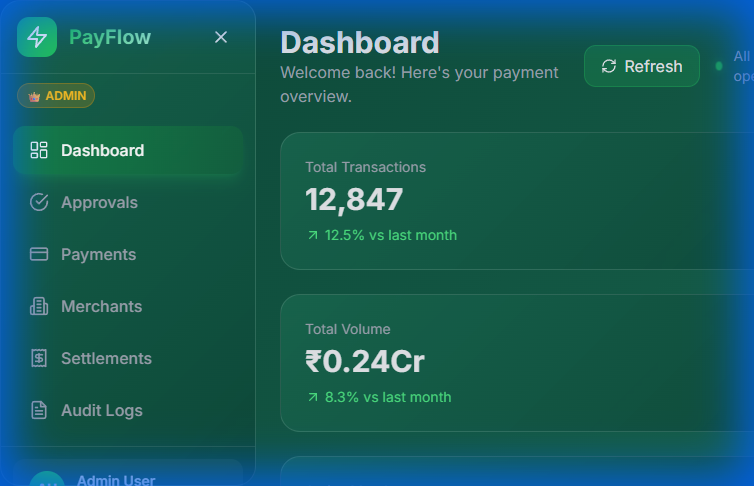
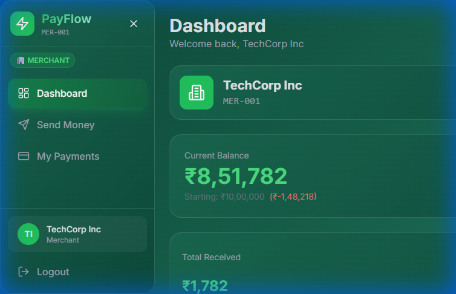
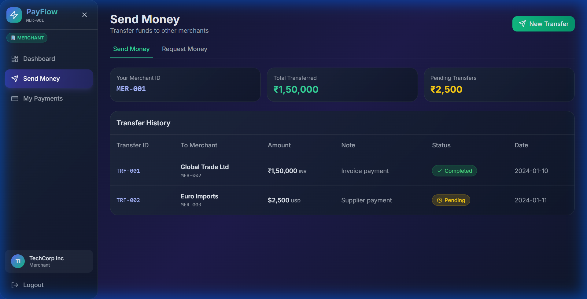
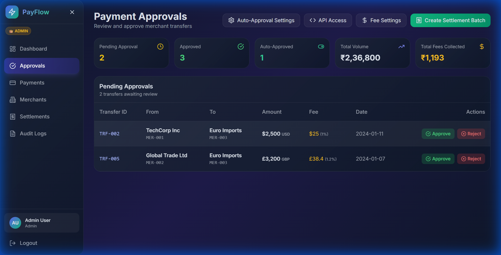

# PayFlow - Multi-Currency Payment Processing Platform

A production-ready fintech platform with real-time FX rates, offline-first storage, compliance-grade audit trails, and an immersive React UI.

## Screenshots

### Admin Dashboard


### Merchant Dashboard (₹10 Lakh Starting Balance)


### Send Money & Request Money


### Admin Approvals & High-Value Alerts


---

## Features

### 🔐 Security & Compliance
- **Rate Limiting** - Max 10 transactions per minute per merchant
- **Idempotent Transactions** - Duplicate detection with unique idempotency keys
- **Comprehensive Error Logging** - All errors logged with severity levels
- **Balance Constraints** - Merchants cannot have negative balances
- **High-Value Alerts** - Transfers ≥₹8,00,000 trigger admin notifications

### 💰 Financial Controls
- **Initial Balance** - Every merchant starts with ₹10,00,000 (10 Lakh)
- **Dynamic Fee Management** - Admins can set custom fee percentages per currency
- **Auto-Approval Settings** - Configure merchants for automatic transaction approval
- **Settlement Batches** - Group completed transactions for reconciliation

### 🔄 Payment Request System
- **Request Money** - Merchants can request payments from other merchants
- **Two-Step Approval** - Merchant approval → Admin approval workflow
- **Real-time Updates** - Instant visibility of pending requests on dashboard

### Backend (Node.js + Express)
- **22+ REST Endpoints** - Payments, currencies, merchants, settlements, audit logs
- **JWT Authentication** - Role-Based Access Control (Admin, Manager, Merchant)
- **Payment Engine** - Real-time conversion, smart fees, lifecycle management
- **Exchange Rate Engine** - Live FX rates with <50ms conversion latency
- **Compliance-Grade Audit** - Immutable logs with before/after snapshots
- **Fraud Prevention** - Velocity checks, duplicate detection, anomaly alerts

### Frontend (React + Tailwind)
- **Dark Mode UI** - Glassmorphism design with smooth animations
- **3D Visualizations** - Three.js transaction flow
- **Real-Time Dashboard** - Live exchange rates, charts, analytics
- **Responsive Design** - Works on all devices

---

## Quick Start

### Prerequisites
- Node.js 18+
- MongoDB (local or Atlas)

### Installation

```bash
# Clone and install backend
cd backend
npm install
cp .env.example .env

# Install frontend
cd ../frontend
npm install
```

### Development

```bash
# Terminal 1 - Start MongoDB (if local)
mongod

# Terminal 2 - Start backend
cd backend
npm run dev

# Terminal 3 - Start frontend
cd frontend
npm run dev
```

Open http://localhost:5173

### Demo Credentials

| Role | Email | Password |
|------|-------|----------|
| **Admin** | admin@payreconcile.com | admin123 |
| **MER-001** | techcorp@payflow.com | Merchant1! |
| **MER-002** | globaltrade@payflow.com | Merchant2! |
| **MER-003** | euroimports@payflow.com | Merchant3! |
| **MER-004** | quickpay@payflow.com | Merchant4! |
| **MER-005** | northbay@payflow.com | Merchant5! |

---

## API Endpoints

### Authentication
| Method | Endpoint | Description |
|--------|----------|-------------|
| POST | /api/v1/auth/register | Register user |
| POST | /api/v1/auth/login | Login |
| POST | /api/v1/auth/logout | Logout |
| POST | /api/v1/auth/refresh | Refresh token |

### Payments
| Method | Endpoint | Description |
|--------|----------|-------------|
| POST | /api/v1/payments | Create payment |
| GET | /api/v1/payments | List payments |
| GET | /api/v1/payments/:id | Get payment |
| POST | /api/v1/payments/:id/execute | Execute payment |
| POST | /api/v1/payments/:id/refund | Refund payment |

### Merchants Balances API (Simulated)
```json
GET /api/v1/merchants/balances

Response:
{
  "apiVersion": "1.0",
  "timestamp": "2024-01-12T06:00:00.000Z",
  "totalMerchants": 5,
  "merchants": [
    {
      "merchantId": "MER-001",
      "merchantName": "TechCorp Inc",
      "initialBalance": 1000000,
      "currentBalance": 851782,
      "totalSent": 152500,
      "totalReceived": 4282,
      "currency": "INR"
    }
  ]
}
```

### Currencies
| Method | Endpoint | Description |
|--------|----------|-------------|
| GET | /api/v1/currencies | List supported |
| GET | /api/v1/currencies/rates | Current rates |
| POST | /api/v1/currencies/convert | Convert amount |

### Settlements
| Method | Endpoint | Description |
|--------|----------|-------------|
| POST | /api/v1/settlements/batch | Create batch |
| GET | /api/v1/settlements | List settlements |
| POST | /api/v1/settlements/:id/reconcile | Reconcile |

---

## Security Features

### Rate Limiting
```javascript
// Configuration
const RATE_LIMIT = {
  maxTransactionsPerMinute: 10,
  maxTransactionsPerHour: 50,
  windowMs: 60000 // 1 minute
}
```

### Error Logging
All errors are logged with:
- Error ID
- Error Type (RATE_LIMIT_EXCEEDED, DUPLICATE_TRANSACTION, INSUFFICIENT_BALANCE)
- Merchant ID
- Timestamp
- Severity Level (info, warning, error)

### Idempotency
Each transaction has a unique `idempotencyKey`:
```javascript
`${fromMerchant}-${toMerchant}-${amount}-${timestamp}-${randomId}`
```

---

## Architecture

```
┌─────────────────────────────────────────────────────────────────┐
│                     React Frontend (Vite)                       │
│  ┌──────────┐ ┌──────────┐ ┌──────────┐ ┌──────────┐           │
│  │Dashboard │ │Send Money│ │ Approvals│ │Merchants │           │
│  └──────────┘ └──────────┘ └──────────┘ └──────────┘           │
└─────────────────────────────────────────────────────────────────┘
                              │
                              ▼
┌─────────────────────────────────────────────────────────────────┐
│                  Express API (Node.js)                          │
│  ┌──────────┐ ┌──────────┐ ┌──────────┐ ┌──────────┐           │
│  │   Auth   │ │ Payments │ │    FX    │ │  Audit   │           │
│  │Middleware│ │ Service  │ │ Service  │ │ Service  │           │
│  └──────────┘ └──────────┘ └──────────┘ └──────────┘           │
└─────────────────────────────────────────────────────────────────┘
                              │
                              ▼
┌─────────────────────────────────────────────────────────────────┐
│                   In-Memory Store + MongoDB                     │
│  Transfers │ Merchants │ Rates │ Alerts │ ErrorLogs            │
└─────────────────────────────────────────────────────────────────┘
```

---

## Docker Deployment

```bash
docker-compose up -d
```

Services:
- **API**: http://localhost:3001
- **UI**: http://localhost:5173
- **MongoDB**: localhost:27017

---

## Performance Targets

| Metric | Target |
|--------|--------|
| Payment creation | <100ms |
| FX conversion | <50ms |
| Daily transactions | 100K+ |
| Settlement accuracy | 99.9% |
| Rate limit | 10 tx/min |

---

## Supported Currencies (9)

INR, USD, EUR, GBP, JPY, CAD, AUD, CHF, SGD

---

## License

MIT
